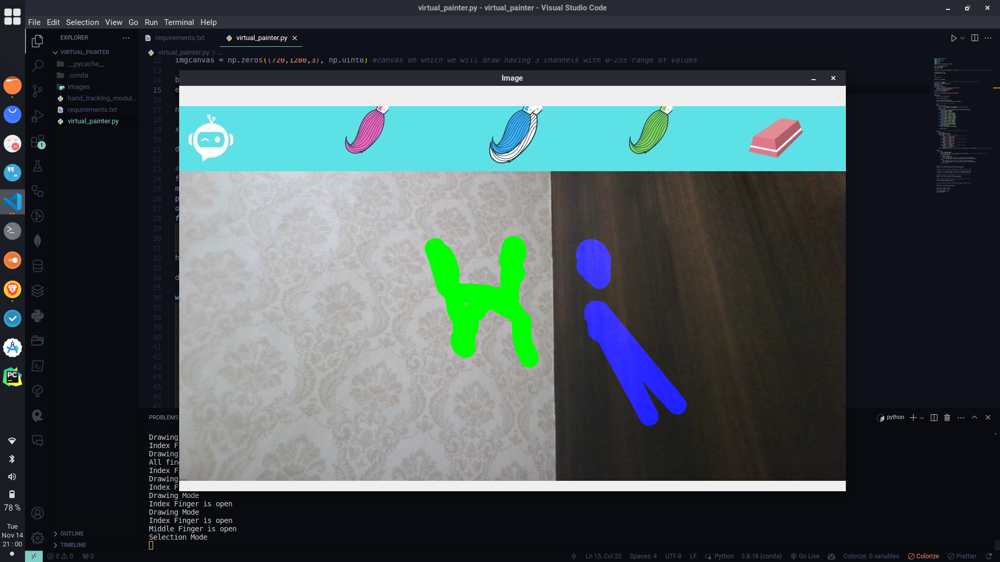

# Virtual Painter using Right Hand

## Project Overview:

The Virtual Painter is a computer vision project that allows users to create digital art by using their Right hand gestures in front of a camera. The project utilizes the MediaPipe library for hand tracking and OpenCV for image processing. Users can draw on a virtual canvas and switch between different drawing tools and colors using specific hand gestures.

## Features:

1. **Hand Tracking:** The project uses the MediaPipe library to detect and track hand movements in real-time.

2. **Drawing Mode:** Users can draw on a virtual canvas by moving their index finger in the air. The drawing color and brush thickness can be customized.

3. **Selection Mode:** Users can switch between different drawing tools and colors by performing specific hand gestures in the header region.

4. **Eraser Functionality:** An eraser tool is available for erasing parts of the drawing on the canvas.

5. **Interactive Header:** The header region displays different drawing tools, and users can interact with it to select their preferred tool.

## Project Files:

1. **hand_tracking_module.py:** Contains the `handDetector` class, responsible for hand tracking and landmark detection.

2. **virtual_painter.py:** The main script that integrates hand tracking with drawing functionality. It captures hand gestures and updates the virtual canvas accordingly.

3. **images folder:** Contains images used for different drawing tools and the canvas header.

## Getting Started:

1. Install the required libraries by running `pip install -r requirements.txt`.

2. Run the `virtual_painter.py` script.

3. Use your webcam to interact with the virtual painter. Follow the hand gestures mentioned in the code comments for drawing and tool selection.

## Usage:

- **Drawing Mode (1 Finger):** Move your index finger in the air to draw on the canvas.

- **Selection Mode (2 Fingers):** Activate selection mode by raising two fingers. Use the gestures in the header region to choose different drawing tools and colors.

- **Eraser (Gesture in Eraser Area):** When in selection mode, move your hand to the eraser area to activate the eraser tool and switch to single finger (index finger) to start erasing.

Happy drawing!